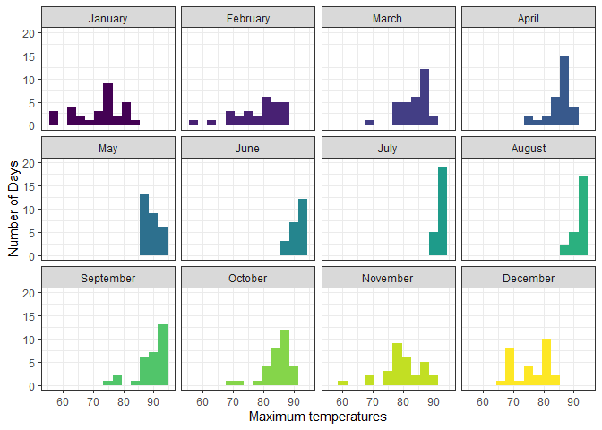
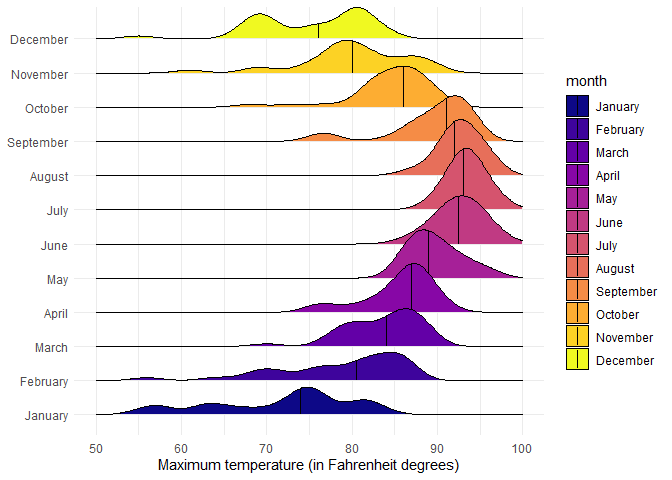

# Data Visualization Project 03


In this exercise you will explore methods to create different types of data visualizations (such as plotting text data, or exploring the distributions of continuous variables).


## PART 1: Density Plots

Using the dataset obtained from FSU's [Florida Climate Center](https://climatecenter.fsu.edu/climate-data-access-tools/downloadable-data), for a station at Tampa International Airport (TPA) for 2022, attempt to recreate the charts shown below which were generated using data from 2016. You can read the 2022 dataset using the code below: 


```r
library(tidyverse)
library(viridis)
weather_tpa <- read_csv("https://raw.githubusercontent.com/reisanar/datasets/master/tpa_weather_2022.csv")
# random sample 
sample_n(weather_tpa, 4)
```

```
## # A tibble: 4 × 7
##    year month   day precipitation max_temp min_temp ave_temp
##   <dbl> <dbl> <dbl>         <dbl>    <dbl>    <dbl>    <dbl>
## 1  2022    10     6       0             84       67     75.5
## 2  2022     9    21       0.00001       93       77     85  
## 3  2022     6    24       0.19          95       79     87  
## 4  2022     9     2       1.41          91       73     82
```

See https://www.reisanar.com/slides/relationships-models#10 for a reminder on how to use this type of dataset with the `lubridate` package for dates and times (example included in the slides uses data from 2016).

Using the 2022 data: 

(a) Create a plot like the one below:


We'll clean the data using the same technique as the slides. However, we will convert the month column to a factor to preserve the order of the months while replacing the numeric values with the month names.

```r
monthNames <- c("January", "February", "March", "April", "May", "June", "July", "August", "September", "October", "November", "December")

tpa_clean <- weather_tpa %>%
  mutate(max_temp = as.double(max_temp),
         min_temp = as.double(min_temp),
         precipitation = as.double(precipitation),
         month = factor(month, levels = 1:12, labels = monthNames))
```

Now we can create the plots. We'll use faceting (by month) to create subplots for each month. The binwidth will be '3' as indicated by the instructions. X and Y axis limits are adjusted to match those shown in the image. "theme_light()" most closely resembles the image, and scale_fill_viridis_d() colors the plots with the viridis scale.

```r
bigPlot <- ggplot(data = tpa_clean, aes(x = max_temp, fill = month)) +
  geom_histogram(binwidth = 3) +
  facet_wrap(~ month) +
  scale_fill_viridis_d() +
  xlim(55, 95) +
  ylim(0, 20) +
  theme_bw() +
  labs(x = "Maximum temperatures", y = "Number of Days") +
  theme(legend.position = "none")

print(bigPlot)
```

```
## Warning: Removed 15 rows containing non-finite values (`stat_bin()`).
```

```
## Warning: Removed 24 rows containing missing values (`geom_bar()`).
```

<!-- -->

Hint: the option `binwidth = 3` was used with the `geom_histogram()` function.

(b) Create a plot like the one below:


Hint: check the `kernel` parameter of the `geom_density()` function, and use `bw = 0.5`.


```r
ggplot(data = tpa_clean) +
  geom_density(mapping = aes(x = max_temp),
               bw = 0.5,
               kernel="optcosine",
               fill = "darkgray") +
  xlim(50,95) +
  labs(x = "Maximum temperature") +
  theme_minimal()
```

```
## Warning: Removed 15 rows containing non-finite values (`stat_density()`).
```

<!-- -->

(c) Create a plot like the one below:


Hint: default options for `geom_density()` were used. 


```r
ggplot(data = tpa_clean, aes(x = max_temp, fill = month)) +
  geom_density() +
  facet_wrap(~ month) +
  scale_fill_viridis_d() +
  xlim(55, 95) +
  ylim(0,0.25) +
  theme_bw() +
  labs(x = "Maximum temperatures", y = "") +
  theme(legend.position = "none")
```

```
## Warning: Removed 15 rows containing non-finite values (`stat_density()`).
```

<!-- -->

(d) Generate a plot like the chart below:


Hint: use the`{ggridges}` package, and the `geom_density_ridges()` function paying close attention to the `quantile_lines` and `quantiles` parameters. The plot above uses the `plasma` option (color scale) for the _viridis_ palette.


```r
library(ggridges)
```


```r
ggplot(data = tpa_clean) +
  geom_density_ridges(aes(x = max_temp, y = month, fill = month),
                      quantile_lines = TRUE,
                      quantiles = 2) +
  scale_fill_viridis_d(option = "plasma") +
  xlim(50, 100) +
  theme_minimal() +
  labs(x = "Maximum temperature (in Fahrenheit degrees)", y = NULL)
```

```
## Picking joint bandwidth of 1.87
```

```
## Warning: Removed 2 rows containing non-finite values (`stat_density_ridges()`).
```

<!-- -->


(e) Create a plot of your choice that uses the attribute for precipitation _(values of -99.9 for temperature or -99.99 for precipitation represent missing data)_.

I am creating a bar chart showing the number of rainy days each month. The number of rainy days will be determined by a precipitation greater than zero but not equal to the "-99.9" value corresponding to missing data. We'll clean the data first to extract only the column we need through summarization and grouping by month. Conditional operators are used to sum the rainy days of interest.


```r
tpa_part_e <- tpa_clean %>%
  group_by(month) %>%
  summarize(rainyDays = sum(precipitation > 0 & precipitation != -99.9))
```

The plot will use "geom_col" for a bar plot that doesn't attempt to scale based on ratio. Other than that, we'll get rid of the redundant legend, color the bars using the Viridis scale to remain consistent, and scale the x-axis labels to fit better.

```r
ggplot(data = tpa_part_e) +
  geom_col(mapping = aes(x = month, y = rainyDays, fill = month)) +
  labs(x = NULL, y = "Number of rainy days") +
  scale_fill_viridis_d() +
  theme_minimal() +
  theme(legend.position = "none",
        axis.text.x = element_text(size = 7))
```

<!-- -->

```r
ggsave(filename = "../figures/rainydays.jpg")
```

```
## Saving 7 x 5 in image
```


## PART 2 

> **You can choose to work on either Option (A) or Option (B)**. Remove from this template the option you decided not to work on. 


### Option (A): Visualizing Text Data

Review the set of slides (and additional resources linked in it) for visualizing text data: https://www.reisanar.com/slides/text-viz#1

Choose any dataset with text data, and create at least one visualization with it. For example, you can create a frequency count of most used bigrams, a sentiment analysis of the text data, a network visualization of terms commonly used together, and/or a visualization of a topic modeling approach to the problem of identifying words/documents associated to different topics in the text data you decide to use. 

Make sure to include a copy of the dataset in the `data/` folder, and reference your sources if different from the ones listed below:

- [Billboard Top 100 Lyrics](https://github.com/reisanar/datasets/blob/master/BB_top100_2015.csv)

- [RateMyProfessors comments](https://github.com/reisanar/datasets/blob/master/rmp_wit_comments.csv)

- [FL Poly News Articles](https://github.com/reisanar/datasets/blob/master/flpoly_news_SP23.csv)


(to get the "raw" data from any of the links listed above, simply click on the `raw` button of the GitHub page and copy the URL to be able to read it in your computer using the `read_csv()` function)

I'm using the FL Poly News Articles dataset. I'll also be using tidytext for text manipulation and lubridate for handling the date column.

```r
articles <- read_csv("https://raw.githubusercontent.com/reisanar/datasets/master/flpoly_news_SP23.csv")
```

```
## Rows: 480 Columns: 3
## ── Column specification ────────────────────────────────────────────────────────
## Delimiter: ","
## chr  (2): news_title, news_summary
## date (1): news_date
## 
## ℹ Use `spec()` to retrieve the full column specification for this data.
## ℹ Specify the column types or set `show_col_types = FALSE` to quiet this message.
```

```r
library(tidytext)
```

```
## Warning: package 'tidytext' was built under R version 4.3.3
```

```r
library(lubridate)
```


```r
# Start by adding stop words to eliminate some of the words that are not of interest
extraStopWords = tibble(word = c("florida", "poly", "university", "polytechnic", "student", "students", "university", "engineering", "campus", "fla", "university's", "lakeland", "science"))
stop_words <- bind_rows(stop_words, extraStopWords) # Join the new stop words with the ones provided
articleTokens <- articles %>% 
  unnest_tokens(word, news_summary) %>% # Unnest words
  anti_join(stop_words, by = "word") %>% # Remove stop words
  mutate(year = year(news_date)) %>% # Create a year column using lubridate
  group_by(year) %>% # Keep the data organized by year
  mutate(year = factor(year)) %>% # Convert the year to a factor for plotting
  count(word, sort = TRUE) %>% # Count the words
  top_n(5, n) %>% # Keep the top five words from each year
  ungroup() %>%
  mutate(word = fct_inorder(word))
```


```r
ggplot(data = articleTokens, aes(x = fct_rev(word), y = n, fill = year)) +
  geom_col() +
  guides(fill = FALSE) +
  labs(x = NULL, Y = NULL) +
  scale_fill_viridis_d() +
  facet_wrap(vars(year), scales = "free_x") +
  theme_minimal() +
  theme(legend.position = "none",
        axis.text.x = element_text(size = 7))
```

```
## Warning: The `<scale>` argument of `guides()` cannot be `FALSE`. Use "none" instead as
## of ggplot2 3.3.4.
## This warning is displayed once every 8 hours.
## Call `lifecycle::last_lifecycle_warnings()` to see where this warning was
## generated.
```

<!-- -->
Unsurprisingly, the same tokens were used with higher frequency in 2020 than in any other year, due to the pandemic.

### Option (B): Data on Concrete Strength 

Concrete is the most important material in **civil engineering**. The concrete compressive strength is a highly nonlinear function of _age_ and _ingredients_. The dataset used here is from the [UCI Machine Learning Repository](https://archive.ics.uci.edu/ml/index.php), and it contains 1030 observations with 9 different attributes 9 (8 quantitative input variables, and 1 quantitative output variable). A data dictionary is included below: 


Variable                      |    Notes                
------------------------------|-------------------------------------------
Cement                        | kg in a $m^3$ mixture             
Blast Furnace Slag            | kg in a $m^3$ mixture  
Fly Ash                       | kg in a $m^3$ mixture             
Water                         | kg in a $m^3$ mixture              
Superplasticizer              | kg in a $m^3$ mixture
Coarse Aggregate              | kg in a $m^3$ mixture
Fine Aggregate                | kg in a $m^3$ mixture      
Age                           | in days                                             
Concrete compressive strength | MPa, megapascals


Below we read the `.csv` file using `readr::read_csv()` (the `readr` package is part of the `tidyverse`)


```r
concrete <- read_csv("../data/concrete.csv", col_types = cols())
```


Let us create a new attribute for visualization purposes, `strength_range`: 


```r
new_concrete <- concrete %>%
  mutate(strength_range = cut(Concrete_compressive_strength, 
                              breaks = quantile(Concrete_compressive_strength, 
                                                probs = seq(0, 1, 0.2))) )
```


1. Explore the distribution of 2 of the continuous variables available in the dataset. Do ranges make sense? Comment on your findings.

2. Use a _temporal_ indicator such as the one available in the variable `Age` (measured in days). Generate a plot similar to the one shown below. Comment on your results.


3. Create a scatterplot similar to the one shown below. Pay special attention to which variables are being mapped to specific aesthetics of the plot. Comment on your results. 


